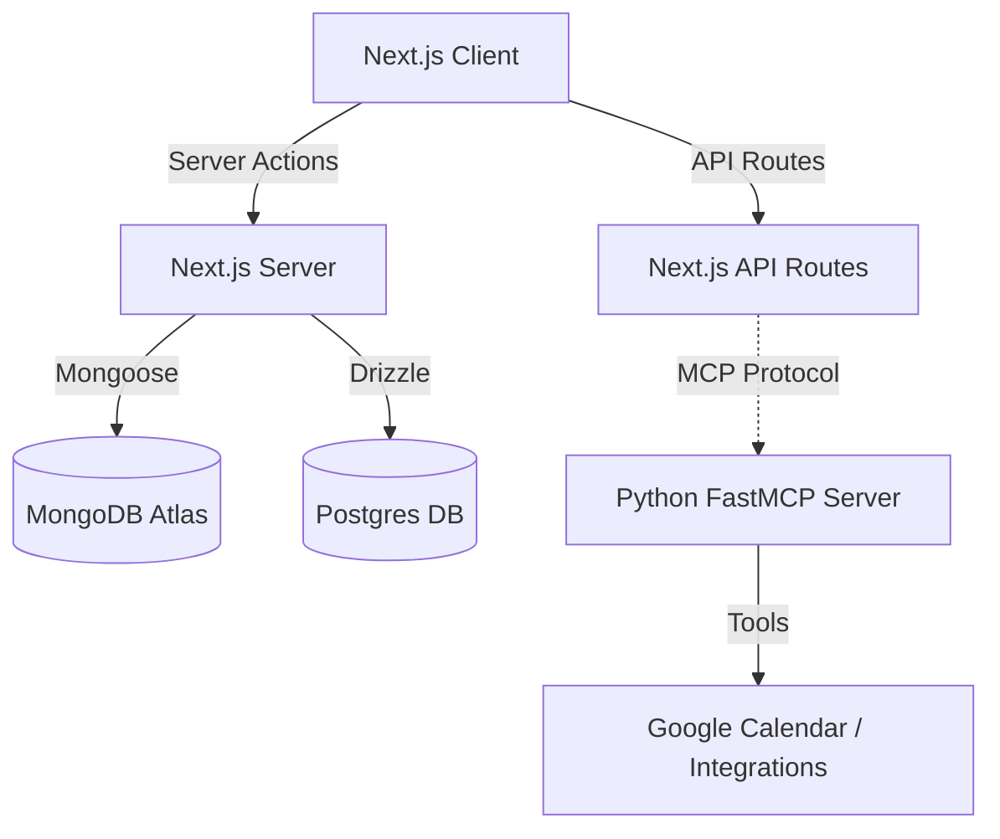

# Architecture

Doable employs a modern, hybrid architecture designed for scalability, reactivity, and advanced AI agent capabilities.

## High-Level Diagram

## Technology Stack

### Frontend
-   **Framework**: Next.js 16 (App Router)
-   **Language**: TypeScript
-   **Styling**: Tailwind CSS v4
-   **UI Library**: shadcn/ui (Radix Primitive based)
-   **State/Animations**: Framer Motion

### Backend Systems
The system utilizes a **Dual-Backend** strategy:

1.  **Next.js Server (Node.js)**:
    -   Handles UI rendering, Authentication (Better-Auth), and standard CRUD operations via Server Actions.
    -   Interacts primarily with MongoDB for document storage.

2.  **AI Agent Server (Python)**:
    -   Built with **FastMCP** (Model Context Protocol).
    -   Located in `api/`.
    -   Responsible for complex reasoning, long-running agentic tasks, and tool execution (e.g., `schedule_meeting`, `reflect_on_task`).
    -   Exposes tools to the LLM that the Next.js frontend can invoke via the Vercel AI SDK.

### Database Architecture
Doable uses a **Polyglot Persistence** strategy:

-   **MongoDB (via Mongoose)**:
    -   Primary store for flexible application data.
    -   Entities: `Users`, `Tasks`, `Projects`, `Employees`.
    -   Chosen for its schema flexibility, ideal for evolving an AI-driven data model (e.g., storing arbitrary "psychology" maps).

-   **PostgreSQL (via Drizzle ORM)**:
    -   Used for structured, relational data where ACID compliance and strict schemas are critical (likely Auth or specific integrations).
    -   *Note: Referenced in package.json dependencies.*

## Data Flow
1.  **User Interaction**: User speaks or types into the Chat Interface.
2.  **frontend Processing**: Vercel AI SDK streams the request to `api/ai/chat`.
3.  **Agent Routing**: The system decides whether to handle the request with a simple LLM call or delegate to the MCP tools.
4.  **Tool Execution**: Complex requests (e.g., "Schedule a meeting") trigger the Python FastMCP tools.
5.  **State Update**: Results are written back to MongoDB and the UI is optimistically updated.
