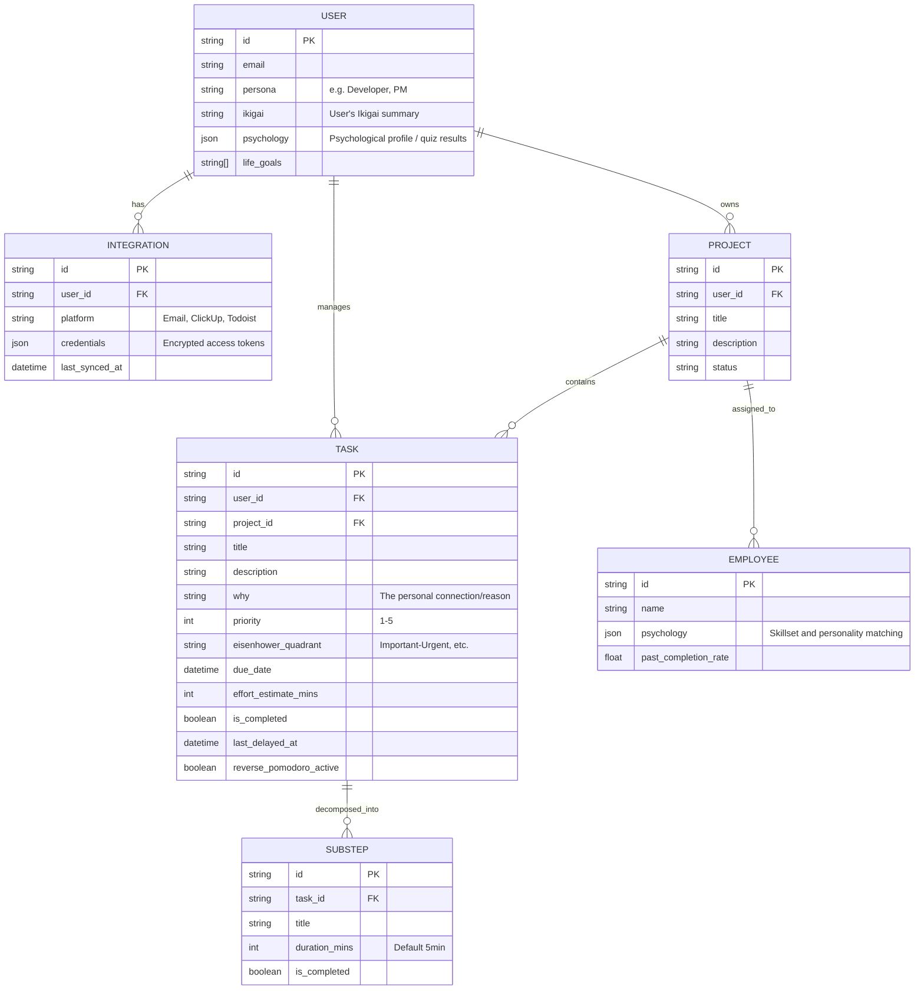

# Database Structure - Doable AI Agent

This document outlines the database schema for the Doable AI Productivity Agent, focusing on psychological task management, automated breakdown, and team suitabilty.

## Entity Relationship Diagram

## Key Entities & Psychological Context

### 1. User & Psychology

- **Ikigai & "Why":** Collected through a quiz to map daily tasks to long-term meaning.
- **Psychology:** Used to automatically categorize tasks in the Eisenhower Matrix (e.g., a person prone to procrastination might have tasks auto-triaged differently).

### 2. Task & Substeps

- **Automatic Decomposition:** Big tasks are broken into `SUBSTEP` entries (5-min blocks).
- **Reverse Pomodoro:** Tracked via `last_delayed_at` and `reverse_pomodoro_active`. If a task is delayed > 2 days, the UI/Agent triggers the "5 min work / 20 min rest" cycle.

### 3. Team & Project Management

- **Employee Matching:** The `EMPLOYEE` psychology is compared against `PROJECT` requirements and `TASK` types to recommend the best fit.
